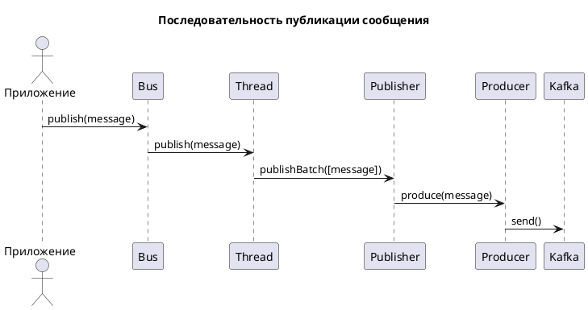
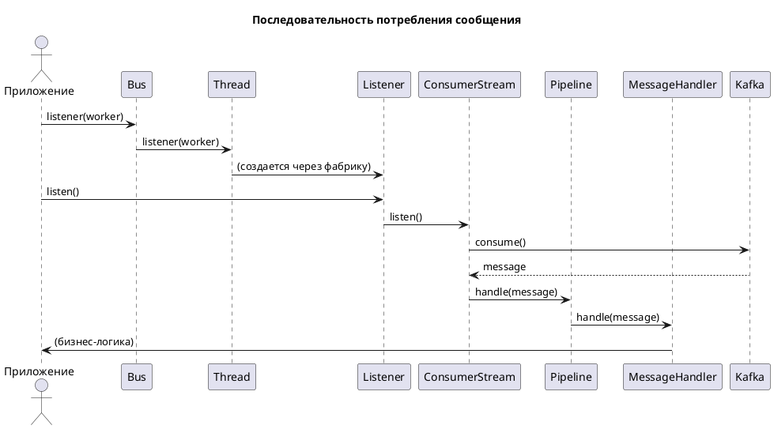

# Архитектура пакета

Этот документ описывает архитектуру пакета `micromus/kafka-bus`.

Пакет предоставляет высокоуровневую абстракцию для работы с Apache Kafka, позволяя легко отправлять и получать сообщения. 
В основе лежит фасад `Bus`, который является единой точкой входа для взаимодействия с системой.

## Ключевые концепции

*   **Шина (`Bus`)**: Центральный фасад пакета. Предоставляет простой API для публикации сообщений и прослушивания входящих сообщений, скрывая внутреннюю сложность.
*   **Соединение (`Connection`)**: Представляет собой настроенное подключение к кластеру Kafka. Пакет поддерживает несколько одновременных соединений (например, для разных кластеров). Управляется через `ConnectionRegistry`.
*   **Поток (`Thread`)**: Логическая обертка над одним соединением. Не является реальным потоком операционной системы. Каждый "поток" инкапсулирует в себе логику издателя (`Publisher`) и слушателя (`Listener`) для конкретного соединения. Управляется через `ThreadRegistry`.
*   **Издатель (`Producer`/`Publisher`)**: Отвечает за отправку сообщений в Kafka. `Producer` — это низкоуровневый компонент, взаимодействующий с драйвером, а `Publisher` — более высокоуровневая абстракция, используемая в "потоке".
*   **Потребитель (`Consumer`/`Listener`)**: Отвечает за получение сообщений из Kafka. `Consumer` — низкоуровневый компонент, а `Listener` — высокоуровневая абстракция, которая организует процесс прослушивания и обработки сообщений.
*   **Сообщение (`Message`)**: Единица данных. Для исходящих сообщений используется `ProducerMessageInterface`, для входящих — `ConsumerMessage`.
*   **Топик (`Topic`)**: Именованный канал (категория) в Kafka, в который публикуются и из которого читаются сообщения.
*   **Конвейер (`Pipeline`)**: Реализует паттерн "Middleware" (посредник), позволяя выстраивать цепочки обработчиков для входящих или исходящих сообщений. Это удобно для добавления сквозной функциональности, такой как логирование, валидация или мониторинг.

## Структура директорий

*   `Bus`: Содержит фасад `Bus` и классы, связанные с логикой "потоков" (`Thread`).
*   `Connections`: Классы для управления соединениями с Kafka (конфигурации, фабрики, реестры).
*   `Consumers`: Логика для получения (потребления) сообщений из Kafka.
*   `Producers`: Логика для отправки (публикации) сообщений в Kafka.
*   `Interfaces`: Контракты (интерфейсы) для всех ключевых компонентов системы. Определяют архитектурные границы.
*   `Pipelines`: Реализация механизма конвейерной обработки сообщений.
*   `Exceptions`: Иерархия кастомных исключений пакета.
*   `Support`: Вспомогательные классы и утилиты.
*   `Testing`: Фейковые реализации (`Faker`) для упрощения тестирования приложений, использующих пакет.
*   `Topics`: Классы для работы с топиками Kafka.

## Детальное описание архитектуры

### Шина (`Bus`)

Класс `Micromus\KafkaBus\Bus` — это основная точка входа. Он использует `ThreadRegistry` для получения нужного "потока", 
который соответствует определённому соединению. По умолчанию используется соединение, указанное в конфигурации, но его 
можно легко переключить с помощью метода `onConnection(string $connectionName)`. Все вызовы для публикации или 
прослушивания сообщений делегируются соответствующему объекту `ThreadInterface`.

### Соединения (`Connections`)

Система соединений построена вокруг `ConnectionRegistry`, который хранит и управляет всеми настроенными соединениями. Каждое соединение реализует `ConnectionInterface`. Пакет поставляется с двумя драйверами:
1.  `KafkaConnection`: Основной драйвер для работы с Kafka, использующий расширение `ext-rdkafka`.
2.  `NullConnection`: "Пустой" драйвер, который не выполняет никаких действий. Полезен для тестирования или в окружениях, где Kafka недоступна.

Конфигурация (`KafkaConnectionConfig`) позволяет детально настраивать параметры `rdkafka`.

### Публикация сообщений (`Producers`)

Процесс отправки сообщения выглядит следующим образом:

1.  Приложение вызывает `Bus::publish(ProducerMessageInterface $message)`.
2.  `Bus` передает вызов в активный `Thread`.
3.  `Thread` может группировать сообщения в пачки (`MessageBatch`) и передает их в `Publisher`.
4.  `Publisher` через `PublisherRouter` определяет, в какой топик отправить сообщение.
5.  В конечном итоге сообщение отправляется с помощью низкоуровневого `Producer`, который общается с Kafka.

### Потребление сообщений (`Consumers`)

Процесс получения сообщений:

1.  Приложение запрашивает слушателя у шины: `Bus::listener(string $workerName)`.
2.  `Bus` делегирует запрос активному `Thread`.
3.  `Thread` через `ListenerFactory` создает объект `Listener`.
4.  `Listener` запускает `ConsumerStream`, который в цикле получает сообщения от Kafka.
5.  Каждое полученное сообщение (`ConsumerMessage`) проходит через конвейер (`Pipeline`), где оно может быть обработано различными посредниками.
6.  В конце конвейера сообщение попадает в `MessageHandler`, который содержит основную бизнес-логику для обработки сообщения. Маршрутизация к нужному обработчику выполняется на основе `ConsumerRoutes`.

### Тестирование (`Testing`)

Для изоляции кода приложения от реальной Kafka в тестах предусмотрены фейковые реализации:
*   `ProducerFaker`: Перехватывает отправленные сообщения и позволяет делать утверждения (`assertPublished`) о том, что и куда было отправлено.
*   `ConsumerFaker`: Позволяет имитировать получение сообщений из Kafka для тестирования обработчиков.

## Диаграммы последовательности

### Публикация сообщения

### Потребление сообщения

